基于 Deno Deploy 的 VLESS 代理服务，支持 WebSocket 传输、内置管理后台与伪装页面。

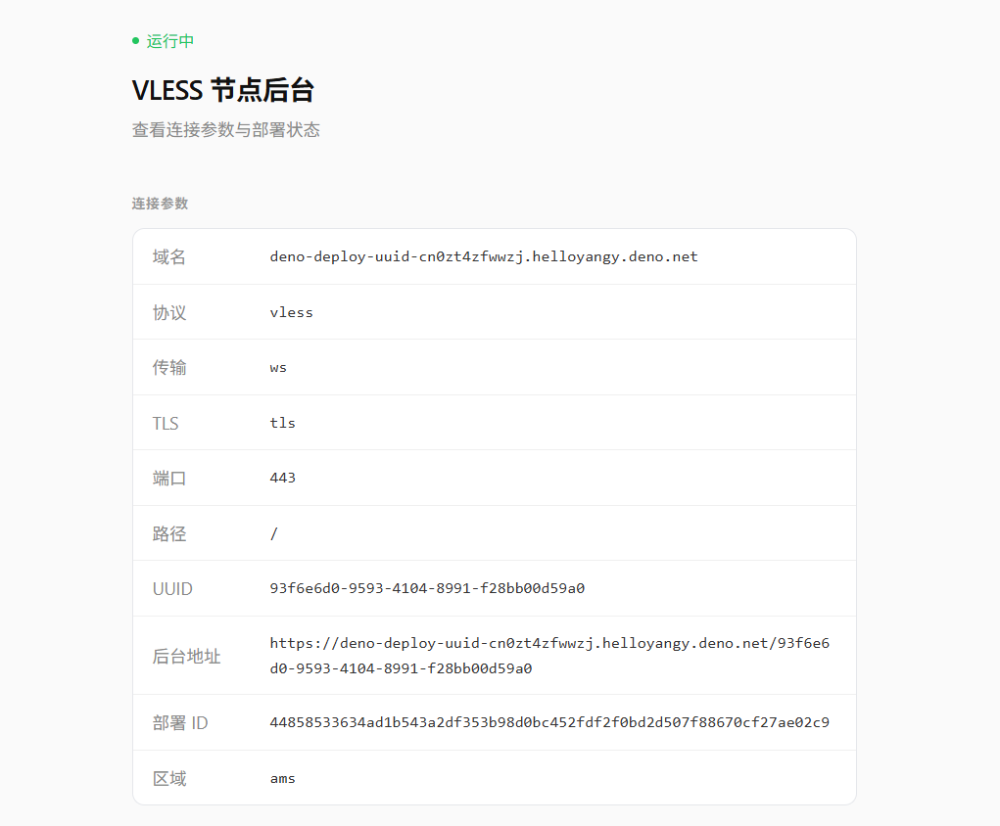

不绑卡只有1GB的流量可以使用，绑卡之后有20GB的流量，最开始是100GB流量，现在下调到了20GB

**部署步骤**

1.先for项目，可以修改deno.tsx文件里面的UUID，默认是：93f6e6d0-9593-4104-8991-f28bb00d59a0

https://github.com/helloyangy/Deno-Deploy-UUID

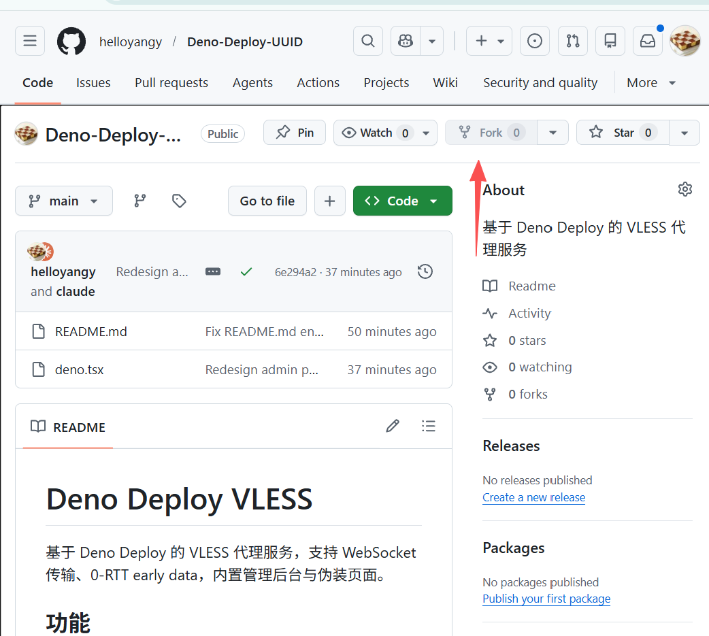

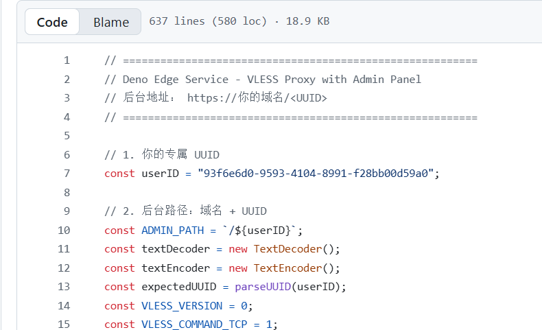

2.使用github登录deno deploy

https://deno.com/deploy

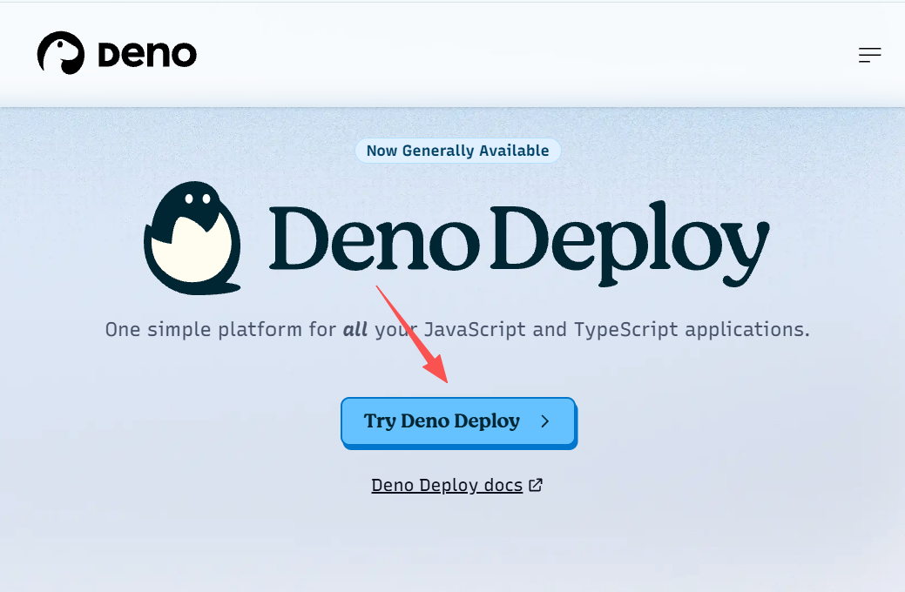

3.无论界面显示什么样，只要找到New app按钮就行

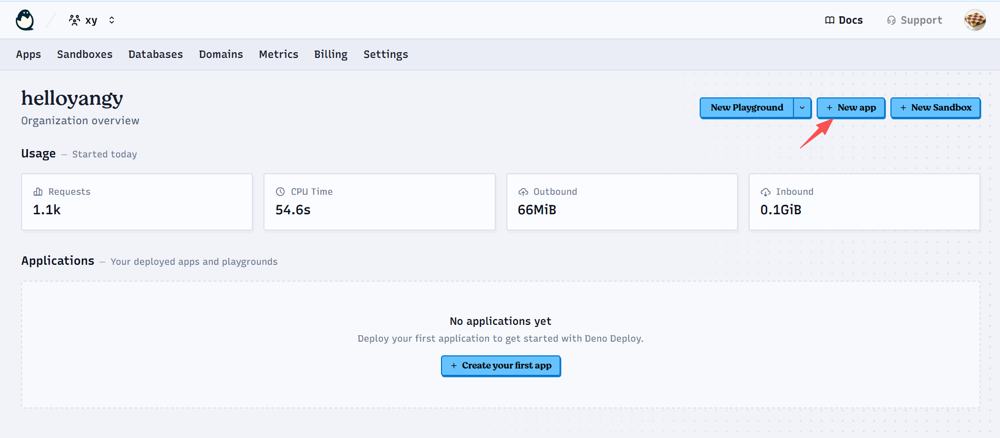

4.绑定我们的github账号

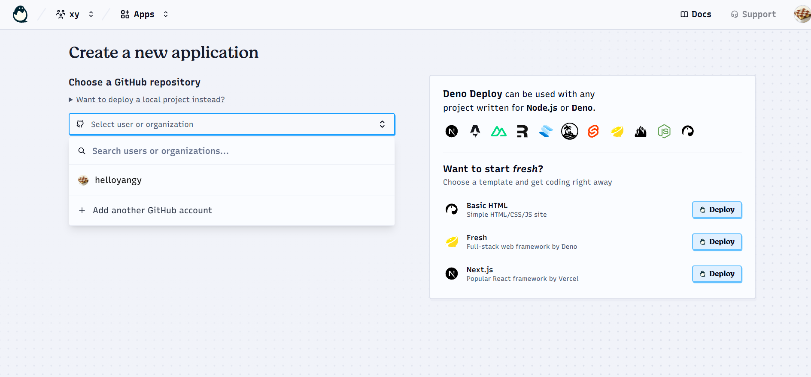

5.再选择for的项目Deno-Deploy-UUID

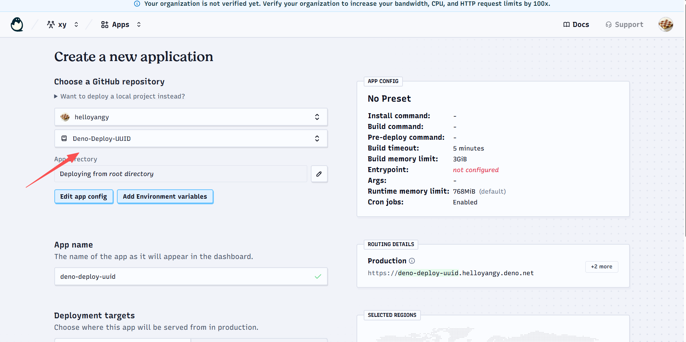

6.往下拉一点，点击Edit app config

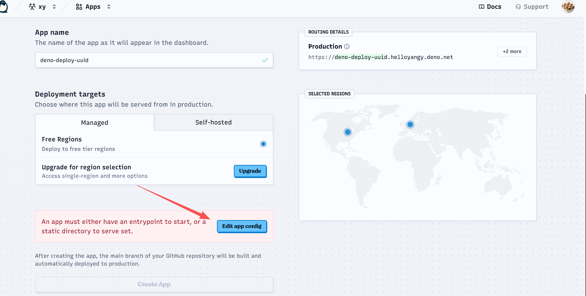

7.下滑找到Entrypoint*输入框，输入deno.tsx

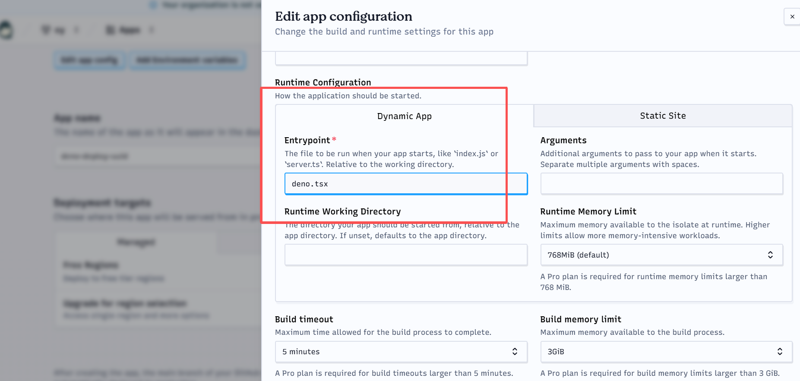

8.点击Create App按钮

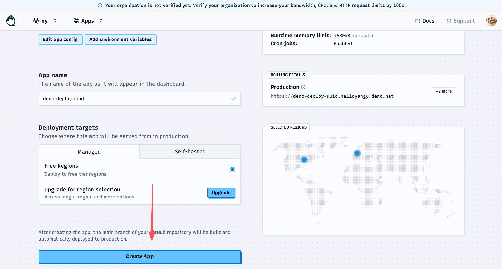

9.等待构建完成，点击预览地址Preview URL

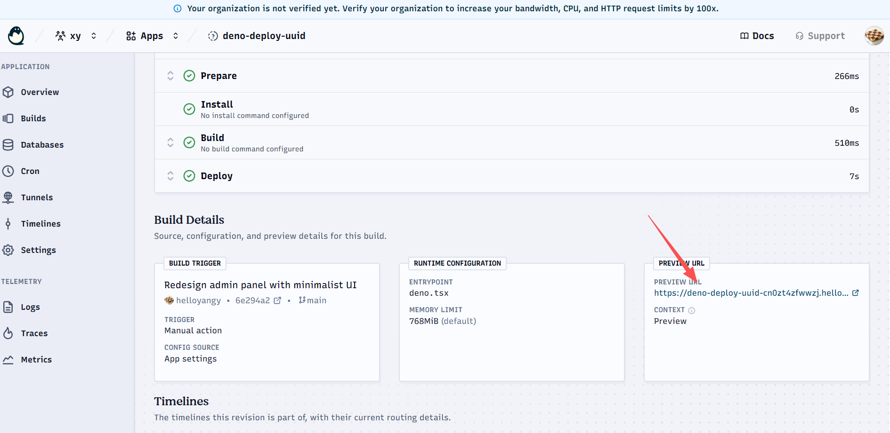

10.这是伪装的界面

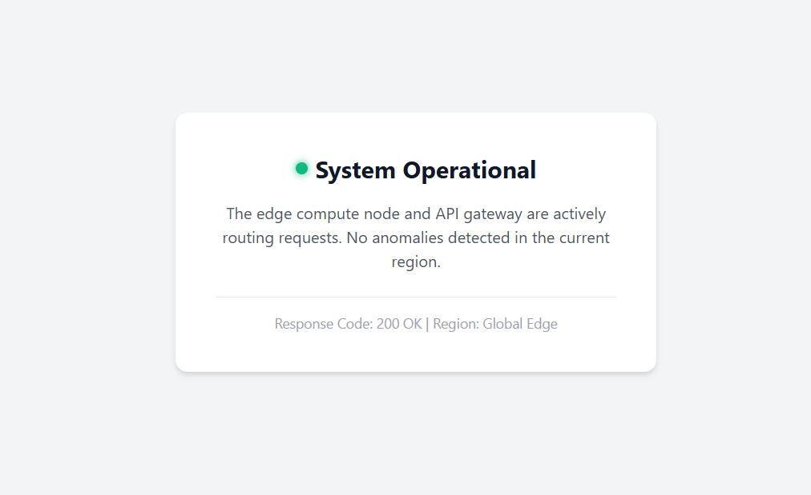

11.访问后台URL是

Preview URL+UUID

例如：https://deno-deploy-uuid-cn0zt4zfwwzj.helloyangy.deno.net/93f6e6d0-9593-4104-8991-f28bb00d59a0

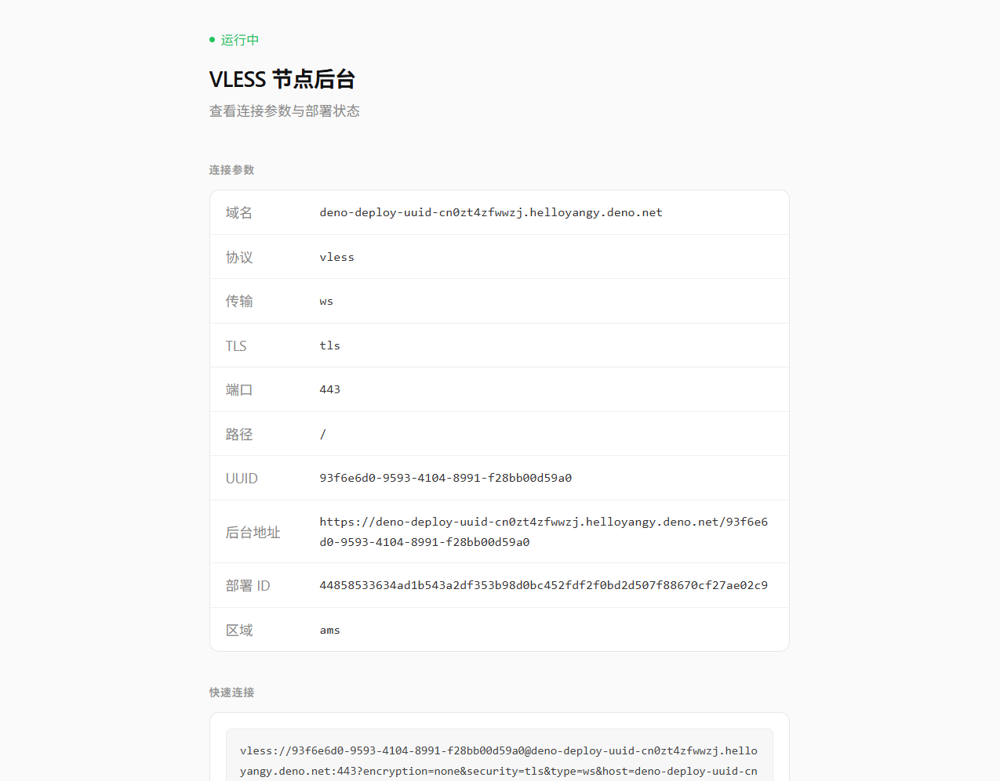

这里面就是节点了，有复制按钮，一键复制